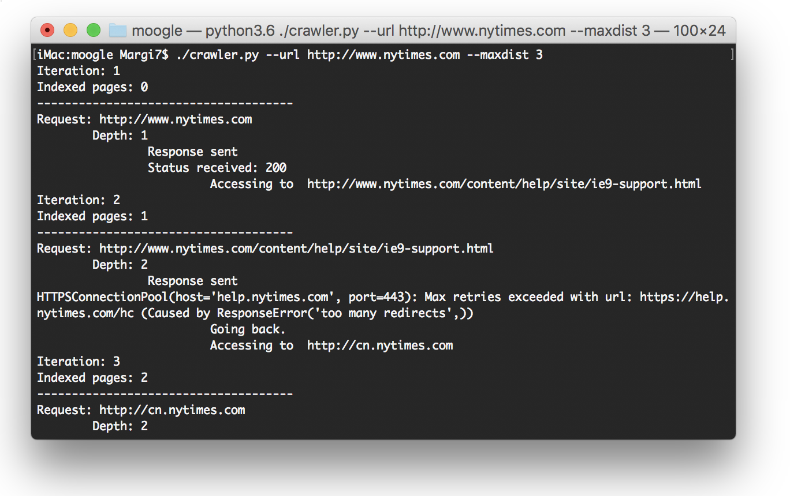
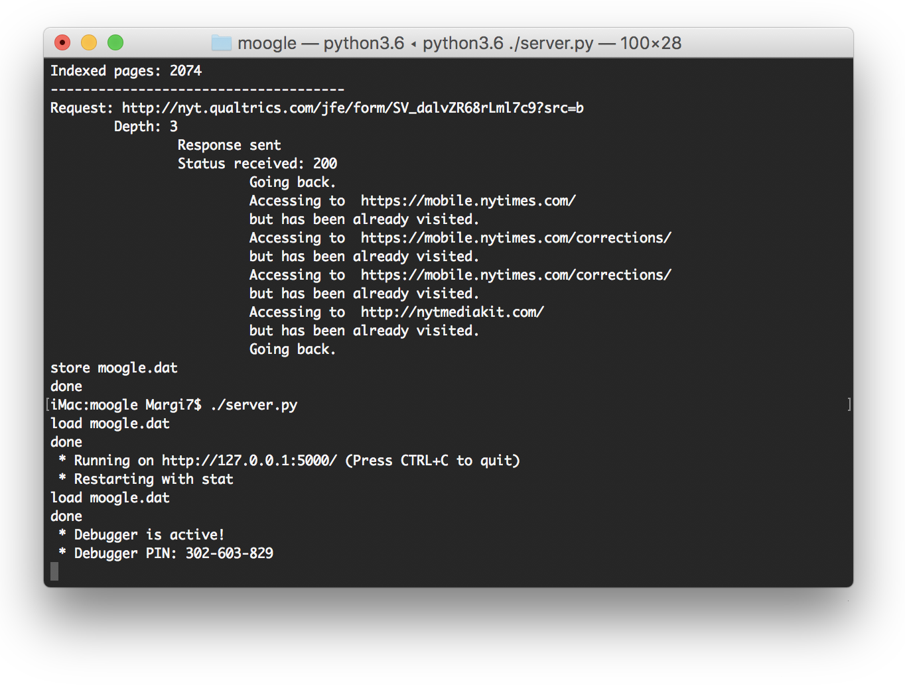
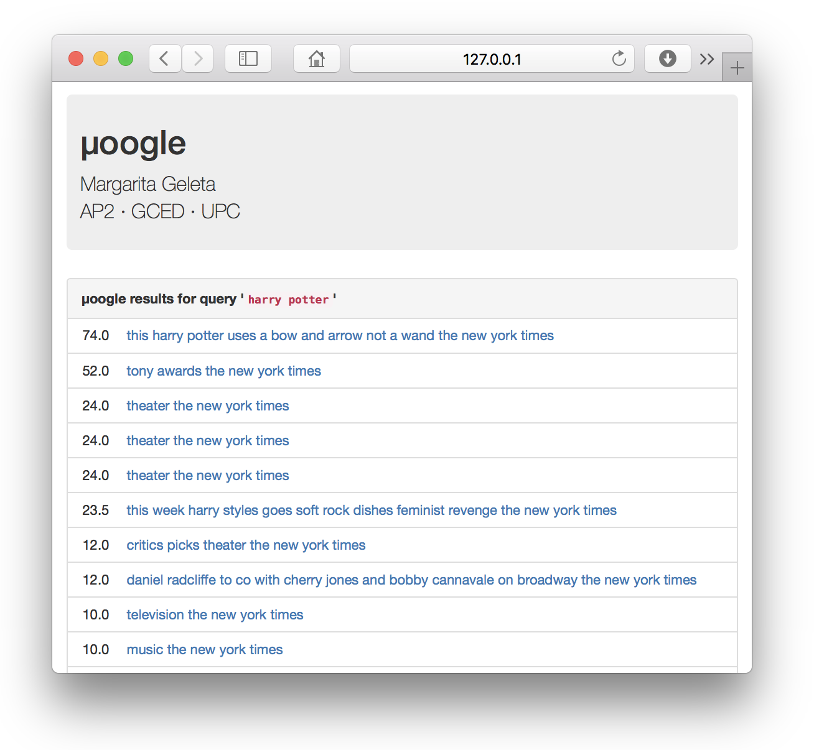
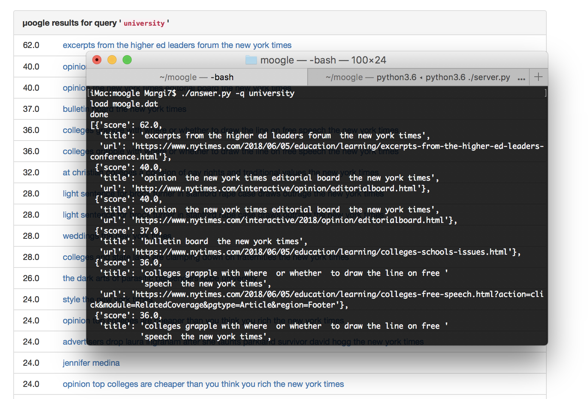
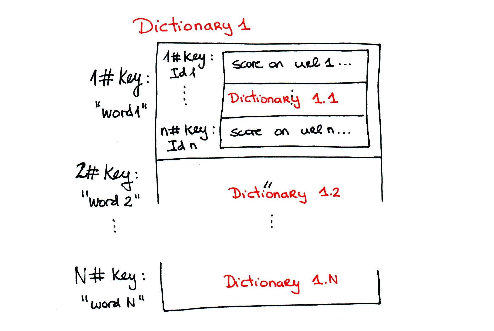

# µoogle

The µoogle project for GCED-AP2 (2018 edition) by Margarita Geleta.


# Documentation

This page describes my µoogle project, as part of practice of the AP2 course at GCED. µoogle stands for
"micro Google" and basically it is a simple search system, which implements a crawler for web pages to find the
answer for users' queries by reporting which pages contain all (or some of) the words they search for.

## Search system recap

The system works in two phases:

1.  In the first phase, the crawler called **SpiderBot** crawls through the Web using the *Depth-first search* algorithm
    and visits some web pages up to a given depth value. During this journey, the crawler saves some information about
    these pages, namely, the url of each visited page (in the urls' dictionary), the title (in the titles' dictionary) 
    and its score (in the indexes' dictionary), according to the score system implemented in the **Score class** (explained 
    later).
    Also, at each iteration, the crawler prints in the console the *status* and the *depth* of each page. Finally, when the
    crawler finishes its execution, this information is saved in a Python object referred as the _database_ and is
    referred as `db` all through the project. The database is saved in the `moogle.dat` file.


2.  In the second phase, the web server loads the database and processes queries from users. Since the user can query
    for more than one word, it has been raised to implement an *accordance factor*. That is, a factor which increases
    the priority of a page given the case when the page contains all or the most of the queried words. It would not be
    accurate if we had used the priorities based on different pages. After collecting the final score of the pages, the
    **answer module** proceeds on listing in the 'result' list - the sorted (by the score priority) list, with the urls
    pages containing the searched word.

## Launching the µoogle
### Install dependencies

In order to install the Python libraries you need, please run this command:

```
pip3 install -r requirements.txt
```
### Set everything to work

The straightforward method is to launch everything through a terminal. We should launch first the crawler to collect
our database and we should give as parameters the root page and set the crawling depth. It can take quite a long time, also
depending on the website we choose to start with. For instance, usually newspaper's pages provide a diversity of links
with different topics (and usually the currently popular topics are in the lower depth levels because they are linked
to the main page). We will provide an example with www.nytimes.com.
Launch the crawler by typing:
```
./crawler.py --url http://www.nytimes.com --maxdist 3
```



After the crawler is done (you will see a message *'done'* in the terminal), we can launch the server module by printing:
`./server.py`. By the way, with www.nytimes.com and depth 3, our crawler has indexed 2074 pages!

At that time, the console will print the url to access to the µoogle and then we can start our interaction with the web server by opening the `http://localhost:5000` URL in your browser.




### Ask µoogle


Now we can start querying in the µoogle. Say we want to find some information about "Harry Potter"... The answer module will be
launched and it is the responsible for taking the word and the associated links and scores from the database and return
the data to the user.



If the queried word does not exist in the databate, the message "Not found" will be displayed.

We can also launch the answer module through the terminal and obtain the list of answers there (the µoogle's second data structure, explained later). 
We enter the query (for instance, "university") in that way: `./answer.py -q university`



## The score system
I have implemented my own **Score System** based on a *where-found* policy. That is to say, 
I followed the HTML rules to find where the queried word was located on each page: that word could be 
positioned on the title, on some of the headers, in the paragraph or in the description of the page. I took each 
location and gave a score by relevance:
```
# Scores by relevance:
    CONST_TITLE_POINTS = 18  # Found in title.

    CONST_DESCRIPTION_POINTS = 12  # Found in description.

    CONST_H1_POINTS = 7  # Found in heading 1.

    CONST_H2_POINTS = 6  # Found in heading 2.

    CONST_H3_POINTS = 5  # Found in heading 3.

    CONST_P_POINTS = 4  # Found in paragraph.`
```
I designed it in a way that words found on titles are more relevant than words simply found in a paragraph. Also, there
is a set of words called *stop words* which are basically the very common ones, like prepositions and conjuntions, and instead
of excepting them from the index, I decided to decrement their score by 1/10. As said previously, there is also the
accordance factor that can increase the priority of a page based on that several words can be found on the same page, but this
part is implemented in the answer module.

## The µoogle's data structures
µoogle's data structures are a simbiosis of **dictionaries**, **sets** and **lists**. Basically, µoogle uses *two* data structures to manage everything: 
the first one is the one the crawler uses to store all the words it founds int the Web. It is a dictionary, where the key is a word itself, and it keeps another, inner dictionary 
with identification numbers of the pages where that word was found. We use these identification numbers in order to distinguish the pages on which a word
was found, since the same searched word could be found on different pages with different score priorities. So, 
we have *dictionaries with scores* inside of a *dictionary of words*:

**dictionary ⟶ {word: dictionary ⟶ {id page: score of the word on this page}}**



The second data structure is the one that the answer module returns in order to display the result for a given query: 
the answer must contain a list of pages related to the query. 
Each entry of the list contains a triplet (a set with three items) with the following fields: 
1.  Title of the page.
2.  The url.
3.  The score of that page.
After that, the list is sorted by the Score priority and is returned to the user.

**list ⟶ [ set1 ⟶ {title1, url1, score1}, set2 ⟶ {title2, url2, score2}, ... , setN ⟶ {titleN, urlN, scoreN} ]**


 
-----------------
<a rel="license" href="http://creativecommons.org/licenses/by-nc-sa/4.0/"></a><br />This work is licensed under a <a rel="license" href="http://creativecommons.org/licenses/by-nc-sa/4.0/">Creative Commons Attribution-NonCommercial-ShareAlike 4.0 International License</a>.
